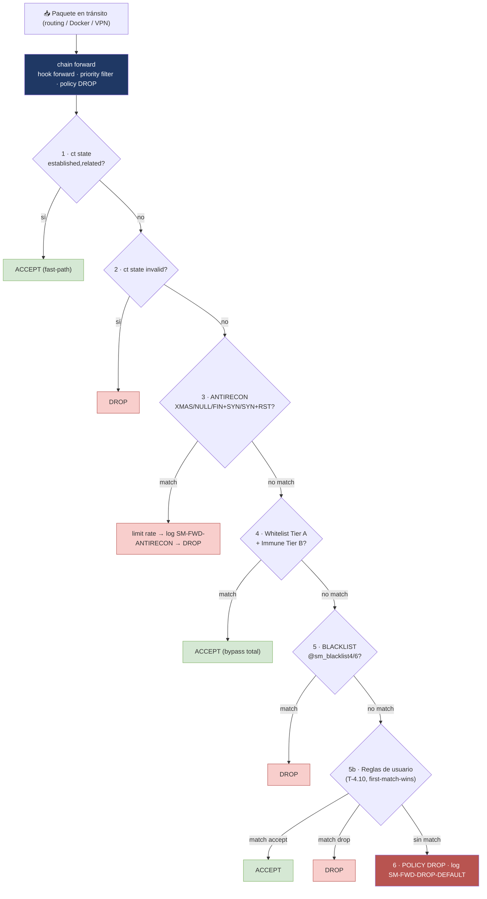

# 🔀 Pipeline de forward — tabla `inet sm_forward`

Este documento cubre la chain `forward` de la tabla `inet sm_forward` — el tráfico **en
tránsito** entre interfaces (routing, containers Docker, VPN), distinto del tráfico
**destinado al propio host**, que se filtra en `chain input` de `inet sm` (ver
[`arquitectura-pipeline-nftables.md`](arquitectura-pipeline-nftables.md)).

`sm_forward` es una tabla separada, con propósito único: filtrar paquetes que pasan *a
través* del host sin ser entregados a él. No incluye servicios (SSH/80/443) — esos son
exclusivos de `input`.

---

## 📈 Recorrido del paquete (Mermaid)



---

## 🔎 Recorrido paso a paso

`chain forward { type filter hook forward priority filter; policy drop; }`

| # | Etapa | Comentario nft | Resultado |
|---|---|---|---|
| 1 | **Conntrack fast-path** | `sm-fwd-fastpath` | ACCEPT inmediato — tráfico ya conocido |
| 2 | **Conntrack inválido** | `sm-fwd-invalid-drop` | DROP |
| 3 | **Antirecon** (XMAS, NULL, FIN+SYN, SYN+RST) | `sm-fwd-antirecon-{xmas,null,finsyn,synrst}` | `limit rate 5/minute` → log `SM-FWD-ANTIRECON` → DROP |
| 4 | **Whitelist (Tier A) + Immune (Tier B)** | `sm-fwd-whitelist4/6`, `sm-fwd-immune4/6` | **ACCEPT (bypass total)** |
| 5 | **Blacklist** | `sm-fwd-blacklist4/6` | DROP |
| 5b | **Reglas de usuario** (motor estilo MikroTik, T-4.10) | `sm-fwd-user-<id>` | **ACCEPT o DROP según la regla — primera coincidencia gana** |
| 6 | **Default** | `sm-fwd-default-drop` | `policy drop` + log `SM-FWD-DROP-DEFAULT` |

> **No hay GeoIP en `forward`.** Decisión fijada en T-4.3: el `saddr` de tráfico en tránsito
> (containers, LAN) es típicamente privado, nunca pertenece a un set GeoIP poblado solo con
> CIDRs públicos por país — una condición `!= @geoallow` ahí sería `true` siempre, sin
> importar la configuración. GeoIP aplica exclusivamente a `input`/`filter`.

**Sets duplicados**: `sm_forward` declara sus propios `sm_whitelist4/6`, `sm_immune4/6`,
`sm_blacklist4/6` — nftables no comparte named sets entre tablas distintas, así que son
copias del mismo contenido que usa `inet sm`, no una referencia compartida.

---

## 🗃️ Tabla `inet sm_nat`

Tercera tabla del proyecto, exclusiva para reglas NAT (sNAT/dNAT/masquerade). `GenerateRuleset`
solo crea la tabla con chains vacías (`prerouting`/`postrouting`, `policy accept`) — las
reglas concretas las agrega el operador a mano:

```bash
nft add rule inet sm_nat postrouting oifname eth0 snat to 1.2.3.4
nft add rule inet sm_nat prerouting tcp dport 80 dnat to 192.168.1.10
nft add rule inet sm_nat postrouting oifname wg0 masquerade
```

---

## 🐳 Docker y `table ip`/`ip6`: por qué coexisten con `inet`

`nft list tables` en un host con Docker y SM-NG muestra **dos dueños distintos** de tablas:

- **SM-NG**: `inet sm`, `inet sm_nat`, `inet sm_forward` — familia `inet` (IPv4+IPv6
  unificados en una sola tabla).
- **Docker**: `ip filter` (o similar), con las chains `DOCKER`, `DOCKER-USER`,
  `DOCKER-ISOLATION-STAGE-1`, `DOCKER-ISOLATION-STAGE-2` — familia `ip` (y su equivalente en
  `ip6` si IPv6 está habilitado en el daemon). Docker las administra a través de su capa de
  compatibilidad `iptables-nft`, no de la sintaxis nativa nft.

Son namespaces de tabla independientes (`inet` ≠ `ip` ≠ `ip6` para el kernel), pero **ambos
enganchan el mismo hook `forward`** del mismo paquete en tránsito — el kernel evalúa las
reglas de todas las tablas que engancharon ese hook, por orden de prioridad.

**Consecuencia práctica, verificada en kernel real (minipc, T-4.10,
`.agents/handoffs/SM-NG-T-4.10-verificacion-minipc.md`, Paso 1):** con SM-NG aplicado y
**sin ninguna regla de usuario en `sm_forward`**, el tráfico de un container Docker se
bloquea:

```
docker run --rm alpine ping -c2 1.1.1.1
→ 100% packet loss, exit=1
```

Esto ocurre porque `sm_forward` tiene `policy drop` (etapa 6) y, sin una regla explícita que
acepte ese tráfico antes de llegar ahí, cae en el default — sin importar que las propias
chains de Docker (`DOCKER-USER` etc.) lo hubieran dejado pasar. **El motor de reglas de
usuario de T-4.10 (etapa 5b) es hoy el mecanismo para permitir tráfico específico de
containers a través de `sm_forward`.**

Ejemplo real, mismo handoff (Pasos 3-4), agregando dos reglas con `forward add` y aplicando
con `firewall apply`:

```
forward add --src 172.17.0.0/16 --dst 1.1.1.1/32 --action drop --comment "bloqueo exfil a 1.1.1.1"
forward add --src 172.17.0.0/16 --action accept --comment "permitir docker general"
firewall apply
```

Resultado en `nft list table inet sm_forward` (orden preservado, entre blacklist y
default-drop):

```
ip saddr 172.17.0.0/16 ip daddr 1.1.1.1 drop comment "sm-fwd-user-1"
ip saddr 172.17.0.0/16 accept comment "sm-fwd-user-2"
```

Y en tráfico real: `ping -c2 1.1.1.1` → 100% packet loss (cae en la regla 1, más específica);
`ping -c2 8.8.8.8` → pasa (no matchea el `daddr` de la regla 1, cae en la regla 2, `accept`)
— la contención selectiva que el motor MikroTik-style permite, sin bloquear todo el tránsito
de la subred.

---

## 🛠️ Motor de reglas de usuario (T-4.10) — referencia rápida

```bash
security-manager-ng forward add --src CIDR --dst CIDR --port N|N-M --proto tcp|udp \
    --action accept|drop --comment "..."
security-manager-ng forward list
security-manager-ng forward del <id>
security-manager-ng forward move <id> <newpos>
```

Reglas evaluadas en orden (`position` ascendente) — primera coincidencia gana, igual que
`/ip firewall filter` de RouterOS. `--src`/`--dst` aceptan CIDR IPv4 o IPv6 (misma familia
si ambos están presentes); `--port` acepta rango (`8000-9000`); si `--port` está seteado,
`--proto` es obligatorio.

**`forward add`/`del`/`move` NO aplican en vivo** — solo escriben en
`/etc/security-manager/sm-ng.db` (SQLite embebido). Siempre requieren `firewall apply` para
materializar en el kernel (mismo modelo que el resto de SM-NG: escribir config → aplicar
atómico con `nft -c -f` + deadman/rollback).

---

## ✅ Validación del ruleset

```bash
sudo nft -c -f /etc/security-manager/sm.nft
sudo nft list table inet sm_forward
sudo nft list tables            # confirma los dos dueños: inet sm* vs ip/ip6 de Docker
```
