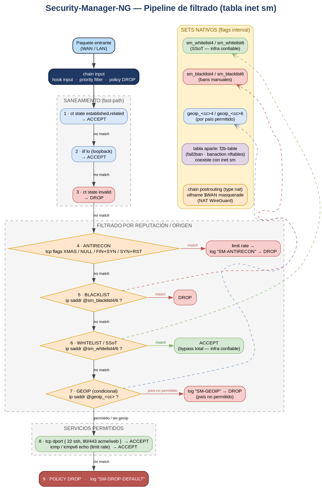
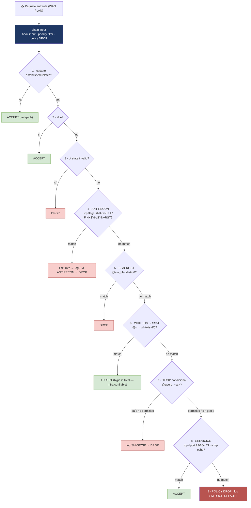

# 🔥 Pipeline de filtrado — tabla `inet sm`

Este documento fija la **lógica del firewall** de Security-Manager-NG: cómo un paquete
entrante recorre la tabla `inet sm` y se decide su aceptación o descarte. Es la referencia
que guía la implementación del backend nftables.

A diferencia del modelo UFW/`before.rules` (fragmentos inyectados con orden dependiente de
marcadores), aquí el recorrido es **declarativo, atómico y de orden total y explícito**.

---

## 📊 Figura 1.1: Topología lógica del pipeline



> Fuente editable: `diagramas/sm-ng-pipeline-nftables.drawio` (draw.io) y
> `diagramas/sm-ng-pipeline-nftables.dot` (graphviz, render del PNG).

---

## 📈 Diagrama 1.2: Recorrido del paquete (Mermaid)



---

## 🔎 Recorrido paso a paso (chain `input`)

`chain input { type filter hook input priority filter; policy drop; }` — todo lo que no se
acepta explícitamente, cae en `policy drop`.

| # | Etapa | Regla nftables (conceptual) | Resultado |
|---|---|---|---|
| 1 | **Conntrack fast-path** | `ct state established,related accept` | ACCEPT inmediato — tráfico ya conocido |
| 2 | **Loopback** | `iif lo accept` | ACCEPT — tráfico local |
| 3 | **Conntrack inválido** | `ct state invalid drop` | DROP — paquetes fuera de estado |
| 4 | **Antirecon** | `tcp flags & (fin\|syn\|rst\|psh\|ack\|urg) == ...` (XMAS/NULL/FIN+SYN/SYN+RST) → `limit rate` → `log prefix "SM-ANTIRECON"` → `drop` | DROP con rate-limit — escaneos |
| 5 | **Blacklist** | `ip saddr @sm_blacklist4 drop` / `ip6 saddr @sm_blacklist6 drop` | DROP — bans manuales |
| 6 | **Whitelist / SSoT** | `ip saddr @sm_whitelist4 accept` / `ip6 saddr @sm_whitelist6 accept` | **ACCEPT (bypass total)** — infra confiable |
| 7 | **GeoIP** (condicional) | `ip saddr @geoip_<cc>4 ...` por país permitido; resto `log prefix "SM-GEOIP"` → `drop` | continúa o DROP |
| 8 | **Servicios permitidos** | `tcp dport { 22, 80, 443 } accept`; `icmp/icmpv6 echo-request limit rate ... accept` | ACCEPT — servicios públicos |
| 9 | **Default** | `policy drop` + `log prefix "SM-DROP-DEFAULT"` | DROP — todo lo demás |

> **Orden crítico:** blacklist (5) **antes** que whitelist (6) — un origen baneado nunca debe
> ganar por estar también en una subred whitelisteada. Whitelist (6) **antes** que GeoIP (7) —
> la infra confiable nunca depende del país de origen.

---

## 🗃️ Sets nativos (reemplazan ipset)

Todos con `flags interval` para soportar rangos/CIDR.

| Set | Tipo | Origen / contenido |
|---|---|---|
| `sm_whitelist4` / `sm_whitelist6` | `ipv4_addr` / `ipv6_addr` | **SSoT** — subredes/VLANs de infra confiable |
| `geoip_<cc>4` / `geoip_<cc>6` | `ipv4_addr` / `ipv6_addr` | rangos por país permitido (descarga GeoIP) |
| `sm_blacklist4` / `sm_blacklist6` | `ipv4_addr` / `ipv6_addr` | bans manuales |

**Recarga atómica:** se regenera el bloque del set y se aplica con `nft -f` (atómico nativo;
no se necesita el patrón swap de ipset).

### Componentes externos a la chain `input`

- **fail2ban** → opera en su **propia tabla `f2b-table`** (banaction nftables). Coexiste con
  `inet sm` sin interferir; sus reglas se evalúan en su propio hook.
- **NAT WireGuard** → `chain postrouting { type nat hook postrouting priority srcnat; oifname $WAN masquerade }`
  dentro de la misma tabla `inet sm`.

---

## ✅ Validación del ruleset

```bash
# Validar sintaxis sin aplicar (siempre antes de cargar)
sudo nft -c -f /etc/security-manager/sm.nft
```

```bash
# Inspeccionar tras aplicar bajo safe-apply (deadman activo)
sudo nft list table inet sm
sudo nft list set inet sm sm_whitelist4
```
